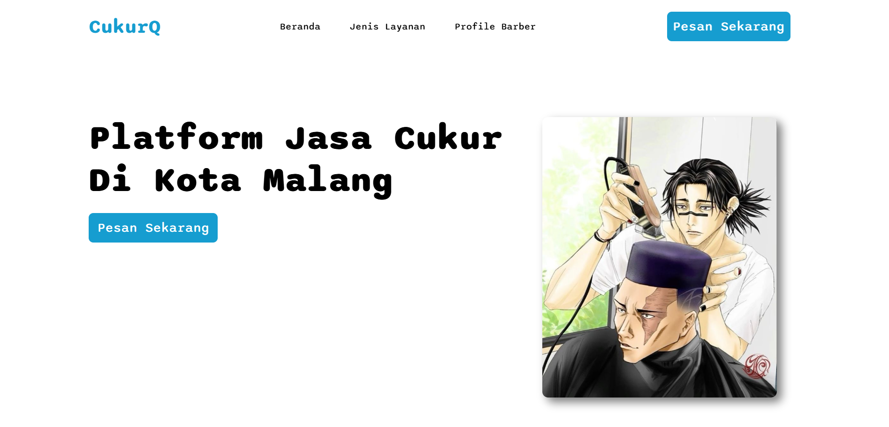
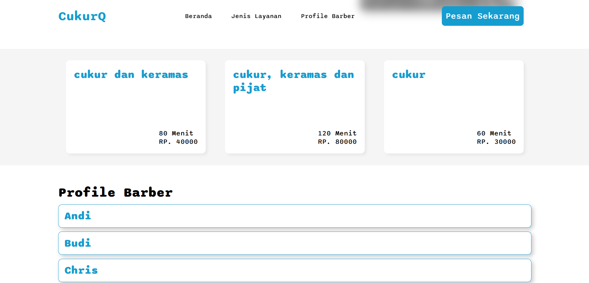
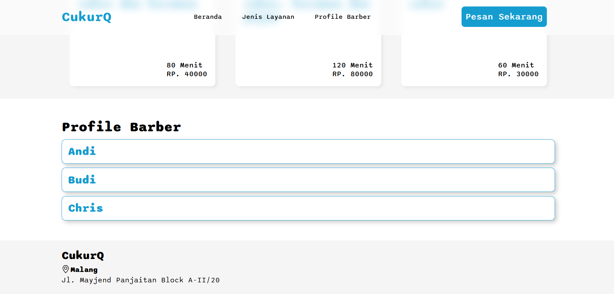

# 💈 CukurQ - Online Barbershop Queue Management System

## 📖 Overview

CukurQ adalah aplikasi web berbasis sistem antrean online yang dirancang untuk membantu pelanggan dan barber dalam mengelola proses antrean secara lebih efisien.

Melalui aplikasi ini, pelanggan dapat mengambil nomor antrean secara online tanpa harus datang lebih awal dan menunggu lama di lokasi barbershop. Sementara itu, barber dapat memantau dan mengatur antrean secara terstruktur sehingga proses pelayanan menjadi lebih rapi dan optimal.

---

## 🎯 Objectives

- Mengurangi waktu tunggu pelanggan.
- Mempermudah pelanggan dalam merencanakan waktu kedatangan.
- Membantu barber mengelola antrean secara digital.
- Meningkatkan efisiensi operasional barbershop.

---

## ✨ Features

### Customer Features

- Register/login antrean.
- Melihat posisi antrean.
- Melihat riwayat antrian.
- Mengedit profile.

### Barber Features

- Melihat daftar antrean aktif.
- Mengelola status antrean pelanggan.
- Memanggil antrean berikutnya melalui WA.
- Mengedit profile.
- Mengatur role akun (hanya untuk super admin).

### System Features

- RESTful API Implementation.
- PostgreSQL Database Integration.
- Dynamic Rendering menggunakan EJS.
- Modular Backend Architecture.
- API-to-API Communication (index.js <-> server.js).

---

## 🛠️ Tech Stack

### Frontend

- HTML5
- CSS3
- EJS

### Backend

- Node.js
- Express.js
- RESTful API

### Database

- PostgreSQL

### Concepts

- API Integration
- CRUD Operations
- Server-Side Rendering (SSR)
- Modular Architecture

---

## 🏗️ System Architecture

```text
Client Browser
      │
      ▼
HTML + CSS + EJS
      │
      ▼
Express Routes
      │
      ▼
API Service Layer
      │
      ▼
PostgreSQL Database
```

---

## 🔄 API Communication

Project ini mengimplementasikan komunikasi antar API menggunakan dua layer utama:

### Route Layer (server.js)

Bertanggung jawab menerima request dari client dan mengarahkan request ke service yang sesuai.

### Service Layer (index.js)

Bertanggung jawab melakukan proses bisnis, mengambil data dari PostgreSQL, serta mengirimkan response kembali ke route.

Pemisahan ini membuat kode lebih:

- Modular
- Mudah dipelihara
- Mudah dikembangkan
- Mendukung scalability

---

## 📸 Screenshots

### Landing Page





---

### Registration/Login Page


---

### Customer Dashboard


---

### Queuing


---

### Queuing History


---

### Profile


---

### Barber Dashboard


---

### Manage Services


---

### Manage Roles


---

## 🚀 Learning Outcomes

Melalui proyek ini saya mempelajari:

- Pengembangan RESTful API menggunakan Express.js.
- Integrasi PostgreSQL dengan Node.js.
- Implementasi komunikasi antar API menggunakan Route Layer dan Service Layer.
- Penerapan arsitektur backend yang modular.
- Pengelolaan data antrean secara real-time.
- Pengembangan aplikasi web menggunakan EJS sebagai template engine.

---
